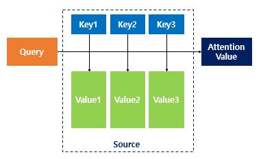
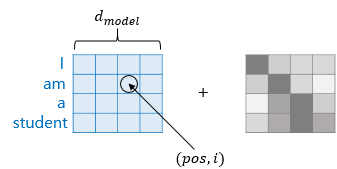

# Attention Is All You Need(2017)
## Introduction
* RNN -> input과 output sequence를 구성하는 symbol의 position을 따라 계산을 수행
    * 각 시각마다 단어를 나열(align)해 h_(t-1)과 input을 이용해 h_t 시퀀스를 얻어냄
* 이런 Recurrent 모델은 병렬처리를 할 수 없기 때문에 긴 시퀀스를 다룰때나 메모리 제약이라는 단점을 가진다.
    * 시퀀스의 길이에 따른 성능 저하 문제를 해결하기 위해 Attention이 고안되었지만 대부분의 Attention 또한 Recurrent 모델을 사용하고 있다. 
* **Transformer**:
    * Recurrent를 제거해 input과 output 간 global dependancy를 구할 수 있는 기법
    * 병렬 처리도 가능!

## Model Architecture

* Transformer: 기존의 인코더-디코더 모델이서 착안한 구조 가짐 + RNN을 없애고 self-attention 레이어와 Feed Forward 네트워크로만 구성

### 1. Encoder and Decoder Stacks
#### Encoder
* 6개의 레이어로 구성, 각 레이어는 두개의 sub-layer로 구성
    * multi-head self-attention layer & position-wise fully connected feed forward network
* sub-layer는 residual connection과 layer normalization으로 연결되어 있다.
    * 각 sub-layer의 output: LayerNorm(x + Sublayer(x))
* 임베딩 레이어를 포함해 모든 sub-layer는 d_model = 512차원을 가진다.

#### Decoder
* 6개의 레이어로 구성, 각 레이어는 3개의 sub-layer로 구성
    * 인코더와 동일한 두개의 sub-layer + masked multi-head attention
    

    
 그림 참조: http://jalammar.github.io/illustrated-transformer/

    
    * masking:
         * 디코더 -> 그림과 같이 항상 현재 시각 이전에 generate 된 output만 참조하기 때문에 **현재 시각 이후의 key들에 대해 masking 해줌**         
* 인코더와 마찬가지로 sub-layer들은 residual connection과 layer normalization으로 연결

### 2. Attention

그림 참조: https://wikidocs.net/31379

* Attention Function:
    * 주어진 query에 대해 key와의 유사도 구해 유사도를 가중치로 해 key와 맵핑되어 있는 각 value에 반영
    * 유사도가 반영된 value의 가중합 구해 리턴
    
#### 2.1 Scaled Dot-Product Attention

* query, key, value로 이뤄진 input
    * query와 key 사이의 dot product를 구함
    * 각각을 로 나눠줌
         * d_k가 커질수록 dot product하는 규모는 커지기 때문에 softmax 함수의 gradient가 매우 작아지게 된다.
         * 이런 효과를 덜어주기 위해  로 나눠 scaling을 해준다.
    * value에 대한 weight를 얻기 위해 softmax function 적용

* 모든 과정은 단어별로 따로 수행되는 것이 아니라 일괄적으로 연산 수행
    * 각 query / key / value를 행렬로 묶어서 다음 식으로 계산
    

#### 2.2 Multi-Head Attention

* d_model 차원의 keys / values / queries로 attention을 계산하는 것이 아니라 h차원으로 나눠서 계산
   * 하나의 attention보다 여러번의 attention을 병렬적으로 수행시 성능이 더 좋다.
   * 각 stage마다 다른 representation를 만들어내기 때문에 각 subspace마다 다른 위치에 attend 된 표현을 얻을 수 있다.
       * '그 동물은 길을 건너지 않았다. 왜냐하면 그것은 너무 피곤하였기 때문이다.'(출처: https://wikidocs.net/31379):
           * 그것(it)이 쿼리였을 때, 즉, it에 대한 Q벡터로부터 다른 단어와의 연관도를 구하였을 때 첫번째 어텐션 헤드는 '그것(it)'과 '동물(animal)'의 연관도를 높게 본다면, 두번째 어텐션 헤드는 '그것(it)'과 '피곤하였기 때문이다(tired)'의 연관도를 높게 볼 수 있따. 이는 각 어텐션 헤드는 전부 다른 시각에서 보고있기 때문!       

* 본 논문에서는 h = 8의 병렬 attention 레이어를 이용, d_k = d_v = d_model / h = 64를 사용했다.

#### 2.3 Applications of Attention in our Model
* Transformer -> 세가지 종류의 multi-head attention을 사용한다.
##### encoder-decoder attention layers
* 쿼리는 이전 시각의 디코더 레이어에서, 키와 그에 해당하는 값은 인코더의 결과값에서부터 얻는다.
    * 이런 구조는 디코더의 모든 위치에서 입력 시퀀스의 모든 부분에 attend할 수 있게 해준다.
    * 기존의 seq2seq의 attention 매커니즘 구조를 따온 것!
    * self-attention X

##### encoder contains self-attention layers
* self-attention 레이어에서는 모든 keys, values, queries는 이전 시각의 인코더의 output에서 나온다.
* 인코더의 모든 위치에서 이전 시각의 인코더의 모든 위치에 attend할 수 있다.

##### self-attention layers in the decoder(Masked Attention)
* 디코더의 모든 위치에서 현재 시각을 포함한 디코더의 모든 위치에 attend할 수 있게 만들어준다. 
* 기존의 인코더-디코더 모델에서 처럼 이전 시각의 정보를 현재 시각의 예측에 사용하도록 만들기 위해 현재 시각보다 미래의 시각에 대해서는 masking을 수행해준다.

### 3. Position-wise Feed-Forward Networks
* 인코더와 디코더의 각 레이어는 fully connected feed-forward 네트워크를 가짐.
    * 네트워크는 두개의 선형식과 ReLU 함수로 이뤄진다.
    

    
    * 선형식의 parameters는 같은 레이어 내에서는 같은 것을 사용하지만 다른 레이어 간은 다른 것을 사용한다.
* input & output dimension: 512 / inner-layer dimension d_ff = 2048

### 4. Embeddings and Softmax
* pretrained 임베딩을 사용했으며, input과 output에서 동일한 임베딩을 사용했다.

### 5. Positional Encoding
* 자연어 처리에 RNN이 많이 사용되었던 이유: 단어 위치에 따라 단어를 순차적으로 입력받아 각 단어의 위치 정보를 알 수 있었기 때문이다.
* 하지만 transformer => 단어 입력을 순차적으로 받지 않기 때문에 단어의 위치 정보를 직접 알려줘야 한다.
    * 이때 각 단어의 위치정보를 얻기 위해 각 단어의 인코더와 디코더의 임베딩 벡터에 **positional encoding**을 더해 input으로 사용한다. 
* positional encoding은 단어 임베딩 레이어와 합쳐질 수 있도록 d_model 차원을 가진다.
* 본 논문에서는 사인과 코사인 함수를 사용해 positional encoding을 구했다.
    * pos: sequence에서 그 단어의 position / i: 그 단어의 임베딩 벡터의 dimension

* 미리 학습된 positional embedding을 사용해도 비슷한 결과를 냈지만 더 긴 sequence에도 잘 추론할 수 있도록 함수 버전을 사용했다.

## Why (we used) Self-Attention

1. 레이어 별 계산 복잡도를 줄일 수 있다.
2. 병령처리를 사용해 계산량을 줄일 수 있다. 
3. 긴 시퀀스에 대해서 계산 path를 줄일 수 있다.
    * 단어가 순서대로 들어갈 때 시퀀스의 길이가 길어질수록 앞과 뒤의 정보를 저장하는데 어려움이 발생한다. 

