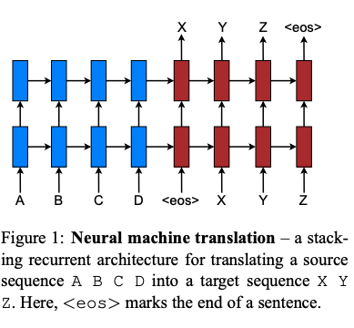
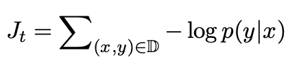
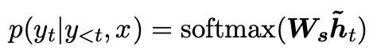
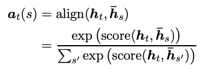
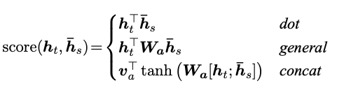
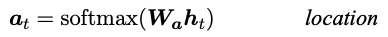

# Effective Approaches to Attention-based Neural Machine Translation(2015)
## 1. Introduction
* 두가지 타입의 attention-based model을 고안
  * global attention: source 문장의 모든 단어를 고려
      * Bahdanau(2015) 모델과 유사하지만 구조적으로 더 단순하게 설계 
  * local attention: 각 시각마다 서로 다른 단어 subset만 고려
      * Xu(2015)에서 고안된 hard & soft attention model의 장점만 모아서 만든 모델
          * global이나 soft attention보다 계산량은 적고, hard attention과는 다르게 미분이 가능
* 다양한 alignment 함수에 대해서도 실험해 성능을 비교(content-based / location-based function)

## 2. Neural Machine Translation
* _NMT 기법에 대한 Recent Works 소개_

* 이 논문에서는 Sutskever(2014)와 Luong(2015)의 연구를 참고해 LSTM을 쌓아 만듦
    * LSTM 유닛은 Zaremba(2015) 논문 참조
* training objective function

## 3. Attention-based Models
* 두 타입의 attention model
    * global: source의 모든 부분을 attend하는지 / local: 일부에만 attend하는지 ➡️ 다른 세부 과정은 다 같지만 문맥벡터를 생성해내는 과정의 차이에 따라 나뉘게 된다!
* target hidden state h_t와 source-side의 문맥 벡터 c_t를 합치는 concatenation layer를 도입
    * attentional hidden state를 얻어내기 위해 두 벡터의 정보를 합치키 위한 레이어
        

        
        * : attentional vector
            * 이 벡터를 softmax layer로 feed해 target 단어를 예측하게 된다.
            

### 3.1 Global Attention

* 인코더의 모든 hidden state 고려해 context vector c_t를 만들어 낸다.
* alignment vector a_t: 현재 target hidden state h_t와 각각의 source hidden state(annotation) 를 고려해 생성

* score function으로는 다음과 같은 방법을 사용:
    * content-based function
    

    
    * location-based function
    

    
* alignment vector a_t를 weight으로 두고 모든 source hidden state에 대해 가중 평균을 구해 context vector c_t 만들어냄
    
## Attention-based Models
## 참고
https://tmaxai.github.io/post/luong-attention/
