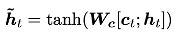

# Effective Approaches to Attention-based Neural Machine Translation(2015)
## 1. Introduction
* 두가지 타입의 attention-based model을 고안
  * global attention: source 문장의 모든 단어를 고려
      * Bahdanau(2015) 모델과 유사하지만 구조적으로 더 단순하게 설계 
  * local attention: 각 시각마다 서로 다른 단어 subset만 고려
      * Xu(2015)에서 고안된 hard & soft attention model의 장점만 모아서 만든 모델
          * global이나 soft attention보다 계산량은 적고, hard attention과는 다르게 미분이 가능
* 다양한 alignment 함수에 대해서도 실험해 성능을 비교(content-based / location-based function)

## 2. Neural Machine Translation
* _NMT 기법에 대한 Recent Works 소개_

* 이 논문에서는 Sutskever(2014)와 Luong(2015)의 연구를 참고해 LSTM을 쌓아 만듦
    * LSTM 유닛은 Zaremba(2015) 논문 참조
* training objective function

## 3. Attention-based Models
* 두 타입의 attention model
    * global: source의 모든 부분을 attend하는지 / local: 일부에만 attend하는지 ➡️ 다른 세부 과정은 다 같지만 문맥벡터를 생성해내는 과정의 차이에 따라 나뉘게 된다!
* target hidden state h_t와 source-side의 문맥 벡터 c_t를 합치는 concatenation layer를 도입
    * attentional hidden state를 얻어내기 위해 두 벡터의 정보를 합치키 위한 레이어
        

        
        * : attentional vector
            * 이 벡터를 softmax layer로 feed해 target 단어를 예측하게 된다.
            

### 3.1 Global Attention

* 인코더의 모든 hidden state 고려해 context vector c_t를 만들어 낸다.
    * alignment vector a_t: 현재 target hidden state h_t와 각각의 source hidden state(annotation) 를 고려해 생성
    

    * alignment vector a_t를 weight으로 두고 모든 source hidden state에 대해 가중 평균을 구해 context vector c_t 만들어냄
* score function으로는 다음과 같은 방법을 사용:
    * content-based function
    

    
    * location-based function
    

*  Bahdanau(2015) Attention(이하 BA)와의 차이점:
    1) 이 논문의 모델(이하 LA(Luong Attention))은 인코더와 디코더 모두 가장 위의 단의 LSTM 레이어의 hidden state를 사용
        * 그에 반해 BA는 인코더에서는 forward와 backward의 모든 source hidden states의 concatenation을, 디코더에서는 모든 target hidden states를 사용
        

        
    2) Computation Path가 간단(그림참조: https://tmaxai.github.io/post/luong-attention/)
        * BA: 
            * 디코더의 hidden state 구할 때 c_t 사용하기 때문에 RNN 연산 수행되는 도중에 c_t가 구해질 때 까지 기다려야 한다.
        

        
        * LA: 
            * 디코더 hidden state h_t는 단순히 RNN의 hidden state 역할만을 하고, 출력 y_t 구할 땐 새로운 hidden state   이용해 구함
                * 출력을 구하는 부분과 RNN 연산 부분이 분리됨!
        

    
    3) BA는 하나의 alignment function(concat)을 이용해 실험했다면, LA에서는 다양한 function들로 실험해 다른 function이 좋은 결과를 냈다는 것을 증명
    
### 3.2 Local Attention

* global attention: 모든 단어를 고려하기 때문에 계산량 증가 & 긴 시퀀스를 번역하는데 문제 발생 ∴ **local attention: 각 target word에 대해 source 문장의 subset을 골라 그 단어들만을 고려**
* Xu(2015)의 soft & hard attention:
    * soft attention: 'global attention'과 비슷하게 모든 패치에 대해 가중치를 두고 계산
    * hard attention: 한번의 하나의 patch만을 고려 → 미분 불가능 & 계산 과정이 복잡
    * local attention: 윈도우 만큼 문맥을 고려 + 미분 가능!
        * soft attention처럼 엄청난 계산량이 필요하지 않고, hard attention보다 학습하기가 용이
* 과정:
    1) 시각 t에 대해 aligned position p_t를 만듦
    2) \[p_t - D, p_t + D\]에 해당하는 hidden state에 대한 가중평균을 구해 c_t를 만듦
* p_t를 구하는 방법으로는 두가지가 있음
    * Monotonic alignment(local-m): p_t = t
        * a_t는 global attention의 a_t 식과 같다.
    * Predictive alignment(local-p)
        * W_p, v_p: Model parameter / S: source sentence 길이 / σ = D/2
        * p_t에 가까운 단어일수록 높은 alignment 점수를 주기 위해 p_t를 기준으로 정규분포를 계산
        * align function은 global attention의 align과 같은 함수이다.
         

         

         
### 3.3 Input-feeding Approach

* 지금의 global & local attention → attentional decision이 독립적으로 만들어짐
    * 하지만 MT에서는 coverage set을 만들어 어떤 식으로 번역이 되고 있는지를 저장
* 따라서 alignment decision에 과거의 alignment information도 고려해주기 위해 과거의 hidden state가 현재 state로 input과 함께 feed 되는 **input-feeding** 기법을 제안
    1) 이전의 align 정보들을 fully 활용할 수 있음(과거의 hidden state에 과거의 문맥벡터가 포함되어 있기 때문)
    2) 네트워크를 좀 더 넓게 구현 가능
    
#### 참고
https://tmaxai.github.io/post/luong-attention/

