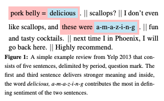
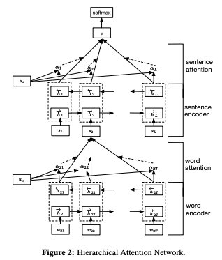
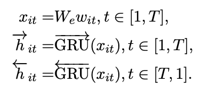
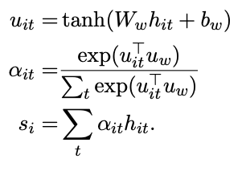
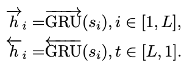
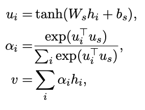

# Hierarchical Attention Networks for Document Classification(2016)
## 요약
* 문서의 계층적 구조(단어-문장-문서)에서 착안한 계층적 attention 구조 가지는 모델
* 단어 attention - 문장 attention의 2-level attention 구조

## Introduction
* 문서 구조에 따른 attention model 구조 도입
    1. 문서의 모든 부분이 중요한 것이 X
    2. 어떤 부분이 중요한지 결정하기 위해서는 단어간 interaction을 모델링 하는 것이 필요하다.
* Hierarchical Attention Network(HAN)
    1. document는 계층적 구조(단어 -> 문장, 문장 -> 문서)를 가진다. 따라서 이런 구조를 따라 먼저 단어를 이용해 문장에 대한 representation을 만든 다음 그것들을 종합해 document representation을 만들어내자!
    2. 각 단어와 문장은 모두 다른 정보를 가지고, 또 문맥에 따라 단어와 문장의 중요도가 달라진다. 
        * 이를 반영하고자 2계층의 attention(단어 level, 문장 level) 매커니즘을 도입
        * 문서 representation을 만들어낼 때 문맥에 따른 요소별 중요도를 반영해 중요한 요소에는 attend하도록 만듬
        * ex) Yelp review
        

        * review의 내용을 결정하는데 있어 첫번째, 세번째 문장이 중요한 역할
        * 이 문장 내의 delicious와 amazing과 같은 단어들이 중요한 역할을 함
        * Attention
            * 더 좋은 성능을 낼 뿐만 아니라 어떤 단어나 문장이 classification 결과를 결정하는데 영향을 미치는지를 알 수 있다. 

## Hierarchical Attention Networks

### Hierarchical Attention
* parameters:
    * L: 문장 개수 / s_i: i번째 문장 / T_i: i번째 문장에 포함된 단어 개수 / w_it: t ∈	[1, T], i번째 문장에 포함된 단어
* 단어 벡터에서 시작해 document level의 representation 벡터를 만들어보자!
* 구조:
    * **Word Encoder**
        1. 각 문장에 대해 문장을 이루고 있는 단어들에 대해 embedding matrix를 이용해 embed 해 준다(x_ij = We(임베딩 행렬) * w_ij)
        2. bidirectional GRU 이용해 단어 양쪽의 정보를 모두 포함한 단어 annotation을 얻는다.
            * forward hidden state와 backward hidden state를 concat해 단어 annotation w_it을 얻게 된다!
        

      
    * **Word Attention**
        * 어떤 문장의 의미를 결정하는데 모든 단어가 기여하는 것은 아님.
            * Attention을 사용해 문장의 의미를 결정하는데 중요한 역할을 하는 단어를 추출하고, 그 representation을 종합해 문장 벡터를 만든다.
        * h_it: word annotation / u_it: h_it의 hidden representation
        

        * STEPS
            1. 하나의 레이어로 구성된 MLP(Multi-Layer Perceptron)에 단어 annotation h_it를 전달해 h_it의 hidden representation인 u_it를 얻는다.
            2. 단어별 중요도를 나타내는 u_it와 단어 레벨 문맥 벡터 u_w를 이용해 normalized importance weight α_it를 구한다.
                * u_w: 어떤 단어가 informative한지를 알려주는 representation
            3. 단어 snnotation의 가중합을 계산해 sentence vector s_i를 얻는다.
            
    * **Sentence Encoder**
        * bidirectional GRU를 이용해 sentence vector를 인코딩 해서 document vector를 만들어낸다.
        * h_i: i번째 문장과 그 주변의 문장에 대한 요약 포함
        

        
    * **Sentence Attention**
        * 문서 내에서 중요한 문장을 알아내기 위해 Attention 사용
            * 문장 level 문맥 벡터 u_s를 이용해 문장 중요도를 계산한다.
                * v: document vector, 문서 내 문장들의 정보를 담고 있는 벡터이다!
              

 
              

        
        
