# Learning phrase representations using RNN encoder-decoder for statistical machine translation(2014)
## Introduction
* 기존의 phrase 기반의 SMT(Statistical Machine Translation) 시스템을 개선하고자 고안한 기법
    * phrase table에서 각 phrase pair에 점수를 매길 때 사용
* RNN Encoder-Decoder 모델: 두개의 RNN을 사용해 하나는 가변 길이 source sequence를 고정 길이 벡터로 맵핑하는 인코더로, 하나는 벡터를 다시 가변 길이의 타깃 시퀀스로 바꿔주는 디코더로 이용하는 기법
    * 조건부 확률을 최대화하는 방향으로 두 네트워크를 jointly하게 학습
        * joint training: 여러 개의 loss들을 더해서 최종 loss로 사용하는 방식 
* 또한 RNN Encoder-Decoder를 사용해 구문에 대한 의미론적, 구문론적 구조에 대한 정보를 저장할 수 있는 연속적인 공간 표현을 만들어 낼 수도 있다는 것을 밝힘.

## RNN Encoder-Decoder
### Preliminary: Recurrent Neural Networks

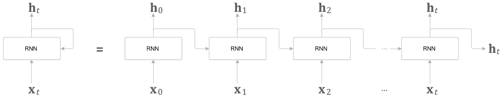

* RNN(Recurrent neural network)
    * 가변 길이 시퀀스  에 대해 은닉 상태 h를 계산해 output y를 만들어내는 신경망 네트워크
    * 은닉 상태 }" title="h_{<t>}" /> 는 다음과 같이 계산한다.
        * 시각 t일 때, }&space;=&space;f(h_{<t_1>},&space;x_{t})" title="h_{<t>} = f(h_{<t_1>}, x_{t})" /> ... (1)
            * f: 비선형 활성화 함수
    * 시퀀스에서 다음 symbol을 예측하는 것을 훈련하면서, 그 시퀀스에 대한 확률 분포를 학습할 수 있다.
        * 시각 t일 때, output은 조건부 확률 
        * eg) Multinomial distribution(1-of-K coding, 원핫 인코딩)일 때 output은 다음과 같이 표현할 수 있다.
            * 모든 가능한 symbol인 j = 1, ..., K에 대해 은 가중치 행렬 W의 j번째 열
        
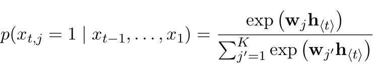

       
        * 이를 이용해 시퀀스 x에 대한 확률을 계산할 수 있다.
        
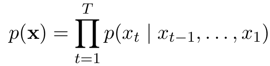

    * 이렇게 학습한 확률 분포를 이용해 각 시각 t에 가장 적합한 symbol을 찾아내는 예측해내는 것이 가능하다.
    
### RNN Encoder-Decoder
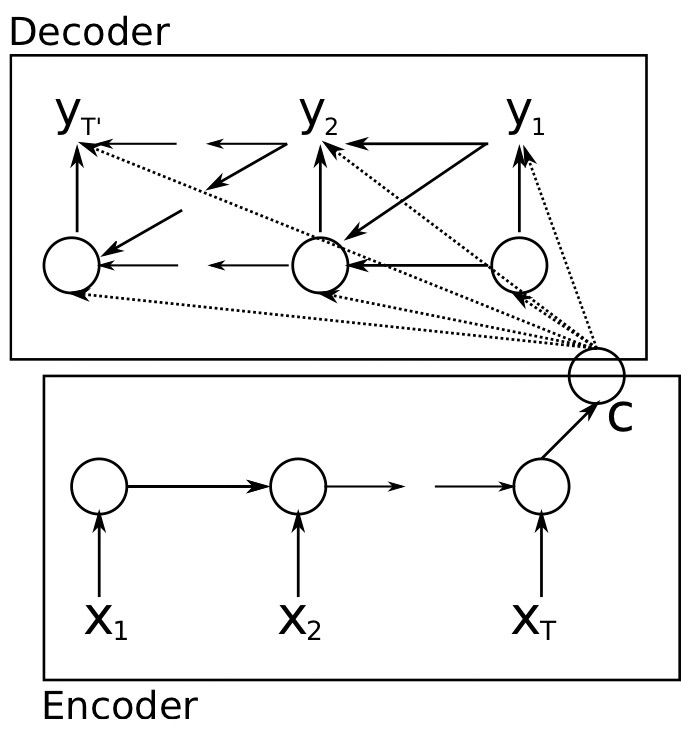
* 두개의 RNN을 사용해 하나는 가변 길이 source sequence를 고정 길이 벡터로 encode하고, 하나는 벡터를 다시 가변 길이의 타깃 시퀀스로 decode 하도록 학습시키는 신경망 네트워크 구조를 고안
* 확률론적 관점에서 설명하자면, source sequence에 대해 target sequence의 조건부 확률을 학습하는 기법이다.
    * eg) 
        * 이때 T와 T'은 다를 수도 있다.
* 구조:
    * Encoder: input sequence x의 각 symbol을 연속적으로 읽을 수 있는 RNN으로 구성된다.
        * (1) 각 symbol을 읽으면서 (1)번 식에 의해 은닉 상태를 계산
        * 전체 input sequence를 다 읽게 되면, RNN의 은닉 상태는 전체 sequence에 대한 summary(context) c가 된다.
    * Decoder: 은닉 상태 }" title="h_{<t>}" />에 대해 타깃 symbol 를 예측하는 것을 학습하면서 output sequence를 만들어내는 것을 train하는 RNN 모델로 이뤄져있다.
        * RNN의 은닉 상태와는 달리 RNN Encoder-Decoder 모델에서는 과 }" title="h_{<t>}" /> 모두  와 input sequence의 summary c에 의해 결정된다.
        * 따라서 디코더의 은닉 상태는 다음과 같이 달라진다.
        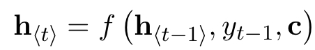
        * 를 예측하는 조건부 확률도 다음과 같이 표현할 수 있다.
        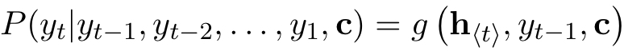
    * 이 두 요소가 다음 조건부 log-likelihood을 최대화하는 방향으로 jointly train 된다.
    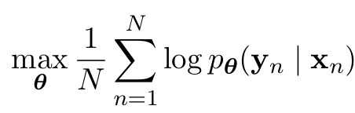
        * θ: model parameter
        * : (입력 시퀀스, 출력 시퀀스)
* 이 RNN Encoder-Decoder를 이용해 두 가지 종류의 task를 수행할 수 있다.
    1) input 시퀀스에 대해 target 시퀀스를 생성
    2) input-output 시퀀스 쌍에 대해 score를 계산

### Hidden Unit that Adaptively Remembers and Forgets
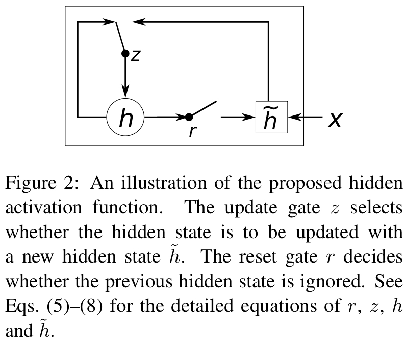
* 기존 LSTM의 unit들 보다 계산과 실행이 쉬운 새로운 hidden unit을 고안
* 구조:
    * Reset gate: 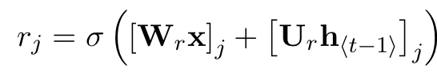
        * σ: logistic sigmoid function
        * x: input
        * : 이전 은닉 상태
        * : 가중치 행렬
    * Update gate: 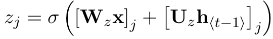
    * 의 Actual activation: 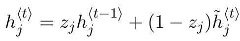
        * 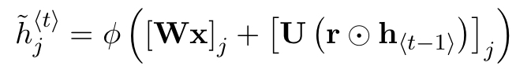
        * 작동 방식:
            * reset gate 값이 0에 가까우면, 은닉 상태는 이전 은닉 상태는 지우고 현재 input으로 은닉 상캩를 초기화 한다.
                * 이를 통해 별로 상관이 없는 정보는 은닉 상태에서 지우고, 더 compact한 표현을 만들어 낼 수 있다.
            * update gate는 현재 은닉 상캐에 이전 은닉 상태의 정보를 얼마만큼이나 보존할지를 결정하게 된다. 
            * 각 hidden unit은 별도의 reset과 update gate를 가지고 있으며, 각 시각마다 dependencies를 계산해나간다.
                * short-term dependencies를 가질 수록 reset gate가 더 자주 활성화 될 것
                * longer-term depencies를 가질 수록 update gate가 더 자주 활성화 될 것이다.
                
    

        
            
 
      
      
      
      
      
      
