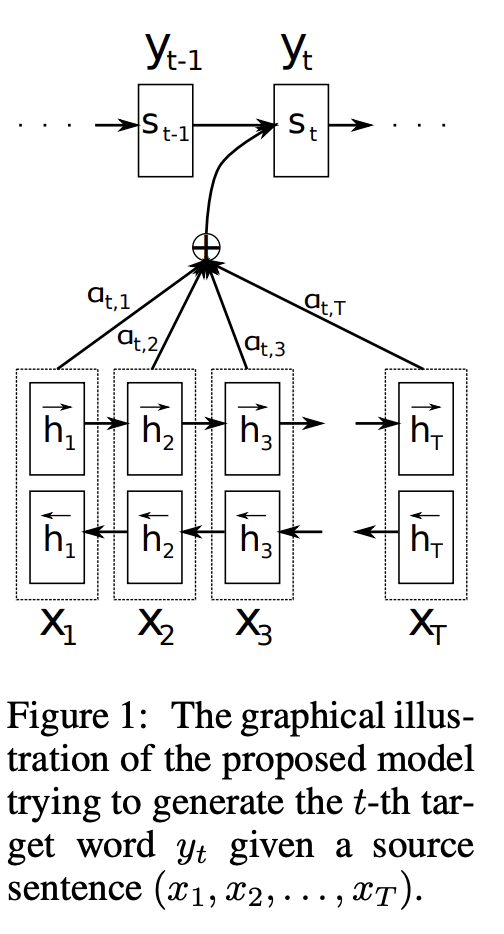
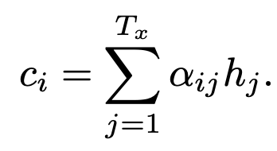
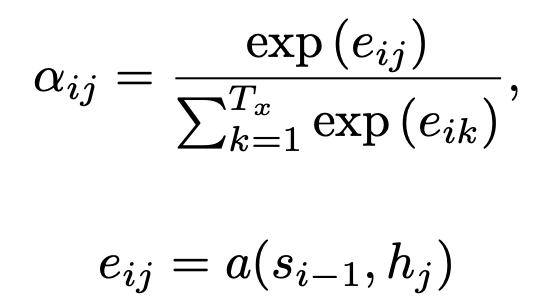
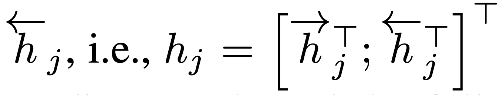

# NEURAL MACHINE TRANSLATION BY JOINTLY LEARNING TO ALIGN AND TRANSLATE(2015)

## Introduction
* 대부분의 NMT 모델 -> 인코더-디코더 모델!
* 하지만 현재의 인코더-디코더 모델은 고정 길이 벡터에 모든 문장에 대한 정보를 우겨넣어야 하기 때문에 문제가 발생한다.
    * 길이가 길어질수록 정확도가 떨어짐.
* 이런 문제를 해결하기 위해 align(attend)과 translate을 동시에 학습시킬 수 있는 기능을 추가한 인코더-디코더 모델을 고안
    * Source sentence에서 가장 관련이 있는 정보가 집중되어 있는 부분을 찾음
    * 중요한 정보의 위치와 이전의 target 단어를 고려해 만들어진 문맥 벡터를 이용해 현재 시각의 target word을 만들어 냄
* 이 논문에서 가장 중요한 부분은, 기존처럼 input 문장 전체에 대해 고정 길이 벡터로 인코딩하는 것이 아니라 **input 문장을 벡터 시퀀스로 인코딩 한다는 것!**
    * 이 벡터 시퀀스에서 어떤 부분에 집중을 할 것인가를 고르게 된다.

## Learning to Align and Translate
### Decoder: General Descripton
* 기존의 조건부 확률 식을 다음과 같이 수정한다.

* 이때 si는 시각 i일 때 RNN의 은닉 상태로 다음과 같은 식으로 계산한다.
    

    
    * 각 시각 i마다 고유한 문맥 벡터를 가지고 있다는 것이 기존과 다른 점!
         * c_i: input 문장에 대해 encoder가 맵핑하는 annotation sequence (h_1, ..., h_Tx), 즉 인코더의 은닉 상태에 의해 정해짐
             * 각 annotation h_i는 전체 input sequence에서 i번째 단어에 대해 강한 focus를 포함한다.
             * 이 annotation들에 대해 weighted sum을 계산해 문맥 벡터 c_i를 계산한다.
               

               
               * 각 annotation에 대한 weight α_ij는 다음과 같이 계산한다.
               

               
               * e_ij: aligntment model a를 이용해 position j의 input 단어와 position i의 output 단어가 얼마나 match하는 지에 대한 점수를 계산
                   * 문장의 어떤 부분에 집중할지를 디코더가 정하기 때문에 인코더는 모든 정보를 가지고 있어야 하는 부담을 줄일 수 있다.
### Encoder: Bidirectional RNN for Annotating Sequences
* 기존 모델에서는 input sequence x를 문장 순서 그대로 첫 단어인 x_1부터 마지막 단어인 x_Tx까지 읽었다면, 이 논문에서는 Bi-RNN을 사용해 각 단어의 앞뒤 단어 모두에 대한 정보를 annotation에 저장하도록 만듬!
* 각 단어 x_j에 대한 annotation은 forward hidden state와 backward hidden state를 concat해서 얻게 된다.

   * RNN이 최근에 들어온 단어에 대해 더 잘 표현해준다는 성질을 이용하면, annotation h_j는 단어 x_j 주변의 단어에 대해 focus할 수 있을 것.
