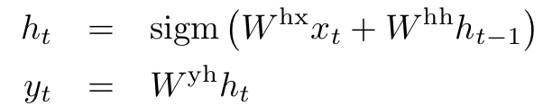

# NEURAL MACHINE TRANSLATION BY JOINTLY LEARNING TO ALIGN AND TRANSLATE(2015)
## Introduction
* 대부분의 NMT 모델 -> 인코더-디코더 모델!
* 하지만 현재의 인코더-디코더 모델은 고정 길이 벡터에 모든 문장에 대한 정보를 우겨넣어야 하기 때문에 문제가 발생한다.
    * 길이가 길어질수록 정확도가 떨어짐.
* 이런 문제를 해결하기 위해 align(attend)과 translate을 동시에 학습시킬 수 있는 기능을 추가한 인코더-디코더 모델을 고안
    * Source sentence에서 가장 관련이 있는 정보가 집중되어 있는 부분을 찾음
    * 중요한 정보의 위치와 이전의 target 단어를 고려해 만들어진 문맥 벡터를 이용해 현재 시각의 target word을 만들어 냄
* 이 논문에서 가장 중요한 부분은, 기존처럼 input 문장 전체에 대해 고정 길이 벡터로 인코딩하는 것이 아니라 **input 문장을 벡터 시퀀스로 인코딩 한다는 것!**
    * 이 벡터 시퀀스에서 어떤 부분에 집중을 할 것인가를 고르게 된다.

## Learning to Align and Translate
### Decoder: General Descripton

(E = mc ^ 2), $$ x_ {1,2} =\frac {-b\pm\sqrt {b ^ 2-4ac}} {2b}. $$

