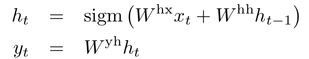

# Sequence to Sequence Learning with Neural Networks(2014)
## Introduction
* 시퀀스를 다루기 위한 기법으로 LSTM을 사용한 구조를 고안
    * LSTM Encoder-Decoder 모델: LSTM을 사용해 각 시각마다 input 시퀀스를 읽어 고정 길이 벡터 표현을 만들어내고, 또 다른 LSTM을 이용해 고정길이 벡터에서 output 시퀀스를 만들어낸다.
    
    

    
* 앞서 이뤄진 다른 연구들에 비해 긴 시퀀스에 대해서도 비교적 잘 다루고 있음을 발견
    * **input sequence의 단어 배열 순서를 바꾸어 계산**
    * 이 방법을 통해 short-term dependencies들이 단순해지고 있음을 확인함
* 질적 연구를 통해 이 모델이 단어의 순서와 능동/수동태도 잘 포착하고 있음을 확인

## The model
* RNN:
    * input sequence가 주어질 때, 다음과 같은 식을 반복 계산해 output sequence를 만들어 낸다.
    

    * RNN은 input과 output 데이터가 같은 길이를 가지고, 단어마다 계산 되는 경우레는 시퀀스 데이터를 쉽게 매핑할 수 있지만, input-output 길이가 다른 경우에는 적용하기 어렵다.
* 이를 해결하기 위해 하나의 RNN을 이용해 input sequence를 고정 길이 벡터로 매핑한 다음에 또 다른 RNN을 사용해 벡터를 타깃 시퀀스로 다시 맵핑하는 방법을 사용한다.(Cho et al. 2014)
    * 하지만 RNN Encoder-Decoder 모델은 Long-Term Dependency를 가진다.
        * 길이가 긴 시퀀스에 대해 잘 학습하지 못함
    * 그에 반해 LSTM은 좀 더 long range temporal dependency에 더 잘 대처한다고 알려져 있기 때문에 이를 LSTM으로 대체하게 된다면 긴 시퀀스에서도 잘 작동할 것.
 * LSTM:
    * RNN과 마찬가지로 input sequence 와 그에 대응하는 output sequence인 에 대한 조건부 확률 을 학습 하는 것이 LSTM의 목표이다.
        1) LSTM의 마지막 은닉 state를 이용해 input sequence로 부터 고정 길이 벡터 v를 얻어낸다.
        2) initial hidden state를 v로 두고 LSTM-LM 식을 이용해 의 확률을 계산한다. 
        

        
        * 활성화 함수: softmax
    * 본 논문의 LSTM 식은 Graves(2013)를 사용
    * 모든 문장은 \<EOS\>라는 문장의 끝을 나타내는 symbol로 끝나게 된다.
    * 실제 모델은 약간의 다른 점을 가진다:
        1) 인코더와 디코더를 LSTM으로 구성
        2) 4개의 레이어로 구성된 LSTM 사용
        3) input 문장의 순서를 reverse
            * 문장 a, b, c을 문장 α, β, γ로 번역한다고 할 때, input 문장의 순서를 바꿔 c, b, a로 입력한다. 이때 target 문장의 순서는 원문과 같은 순서(α, β, γ)로 번역한다.
            * a는 α와, b는 β와 거리상 가까워지게 되므로 input과 output 사이의 관계를 더 잘 포착할 수 있다.

         

    